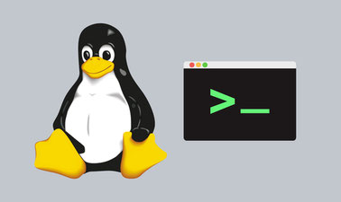

# dockers-clusters-scripts

Repositorio con scripts usados en el cluster de la minipc



## Instalacion

1) Instalar python3

    ```bash
    sudo apt install python3
    ```

2) Instalar dependencias de pip

    ```bash
    pip3 install -r requirements.txt
    ```

3) Agregar crons a linux

    Ejecutar:

    ```bash
    sudo vim /etc/crontab
    ```

    Agregar lo siguiente:

    ```bash
    * * * * * brian python3 <repo_path>/src/docker-sync/script.py > /tmp/docker-sync.log 2>&1
    0 4 * * * brian python3 <repo_path>/src/backup/script.py > /tmp/backup.log 2>&1
    ```
